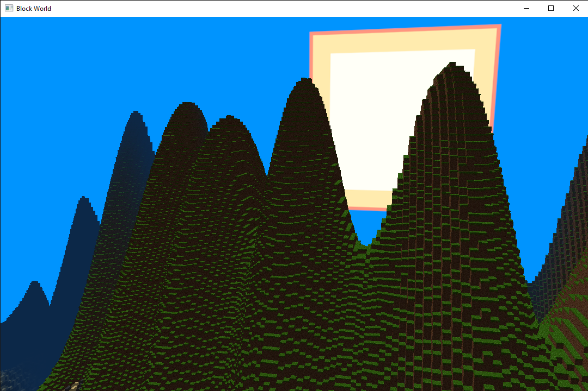
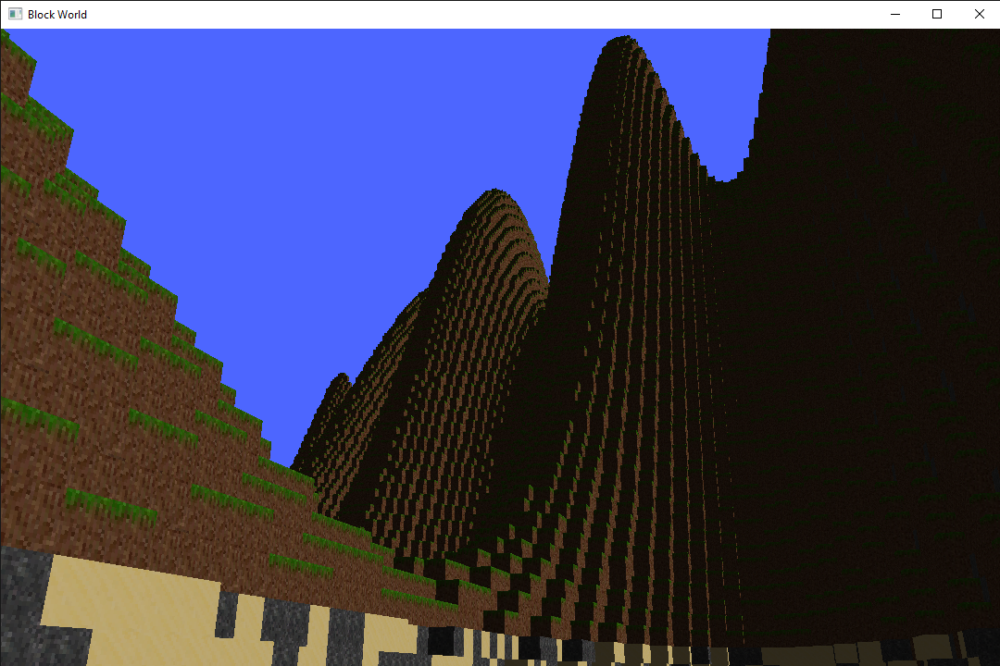
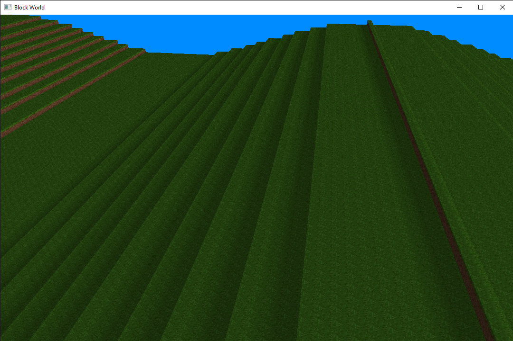

# BlockWorld

A performance-aware, open, procedurally-generated voxel world with interactive block placement and gameplay elements such as entity physics similar to Beta Minecraft built with C++, OpenGL, and GLMath.
This is my first from-scratch programming project in C++, and I am using it to familiarize myself with graphics programming, data structures, and writing performance-aware code for modern hardware.

Currently a work-in-progress.

## Features
- Multithreading
- SIMD intrinsics (AVX2)
- Binary-meshing system
- Geometry shaders

## Challenges
1. Binary-meshing. Like many voxel engines, BlockWorld handles a large amount of data that has to be live-loaded. A prominent source of slow-down, especially in procedurally-generated worlds or those where chunks may be alterred in real-time, handling large batches of data at runtime is tantamount. BlockWorld optimizes the speed of converting blocks in a chunk into a mesh for rendering. This is accomplished by loading the data as a binary array with 3D structure, and operated upon using bitwise logic operations to transform the data, and iterate over the array to find what block faces to push the a batch. Chunks in BlockWorld are 15x256x15 to maximize the efficiency of these operations, and AVX2 intrinsics are used to further speed up the process.
2. Design. For this project, I avoided tutorials and tried to design game components from scratch.
3. Texture-orientation. The voxel engine further limits overhead from data transfer between the CPU and GPU by leveraging geometry shaders. Each face of a block is represented by one vertex, which is live-converted into a quad live using linear algebra. This also conveniently allows the program to naturally use face-culling. However, making sure that textures such as grass which have direction-based textures are correctly aligned was a difficult task.
4. Handling responsibility for the GL state machine. Calls to the state machine can add overhead to the program, so deciding how to order the binding of different elements, and in which functions this occurs, matters. In addition to the state machine, doing proper memory cleanup on the GPU required generating some personal RAII-style object wrappers for GL data such as buffers and arrays which could handle allocation and deallocation, a lot like pointers. In the future, this system may be replaced with a caching system to handle GPU operations more abstractly.

## Future Features
1. Pseudo-random procedural generation of terrain.
2. Water and other transparent objects, such as glass.
3. Block-breaking and placing.
4. Player-world physics.
5. Further shrinking of mesh size by comparing chunks further.
6. A better, possibly custom, data structure for handling the specific demands that a 2D grid of chunks composing the world entails.
7. Entities.
8. Shadows.
9. Cross-platform implementation on Apple and Linux.
10. Music/sounds
11. Functionality for non-AVX2 machines.
12. Cross-platform build compatibility.

# How to Install and Run
1. Ensure processor has at least AVX2 x64 capabilities and computer is running Windows, and have a directory for glew, glfw, and glm libraries installed.
2. Compile the program on Distribution, Release, or Debug.
3. Optionally move the BlockWorld.exe from any of the folders in "bin/" and move it to any folder, so long as "Resources" is also present in the folder.
4. Click to run, press Esc to exit, or run in the Visual Studio environment.

# How to Contribute
- Currently requires Visual Studio to compile.
